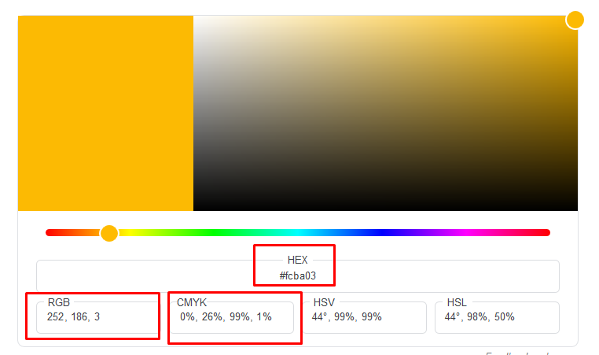

# Farben

## Benötigtes Vorwissen
- Keines

## Ziel dieser Page
Verstehen wie Farben definiert werden

## Beschreibung
Es gibt die Möglichkeit 
- Hexadezimalwert
- RGB
- HSV

Bei google können entsprechende Farbcodes eingesehen und übersetzt werden

BSP:

## Implementierung



# Final Links & weitere Quellen
[Link zu meinen Web-Basics-Implementierungen-Landingpage](https://determined-varahamihira-d7b5b4.netlify.app/)
[BrowserPluginColorzilla](https://chrome.google.com/webstore/detail/colorzilla/bhlhnicpbhignbdhedgjhgdocnmhomnp?hl=de)