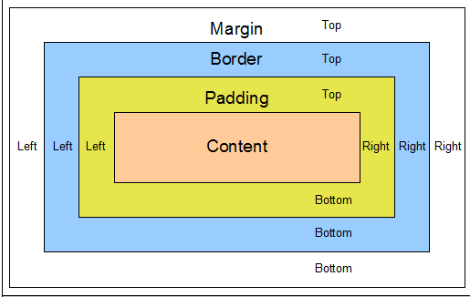

# Paddings und Margins

## Benötigtes Vorwissen
- Grundlegend CSS-Eigenschaften
## Ziel dieser Page

## Beschreibung
Mit Margins und Paddings können von Elementen(z.B. Div-Boxen) in den Kontext der Webseite eingebettet werden. Folgende Grafik veranschaulicht die Thematik:

Grundsätzlich gibt es den Content und zu dem Content gibt es eine Broder. Der Abstand zwischen Content und Border nennt man Padding = der innere Abstand. ZUsätzlich gibt es eine Abstand zwischen der Border und dem Äußeren Abstan zu der Border. Somit haben zwei angrenzende Elemente den Berührpunkt bei jeweils (border+Margin)

## Implementierung

Hier gibt es weder Margin noch Padding:


Implementierung Margin:


Implementierung padding aber kein Margin:


Implementierung Margin und Padding:


# Final Links & weitere Quellen
[Link zu meinen Web-Basics-Implementierungen-Landingpage](https://determined-varahamihira-d7b5b4.netlify.app/)